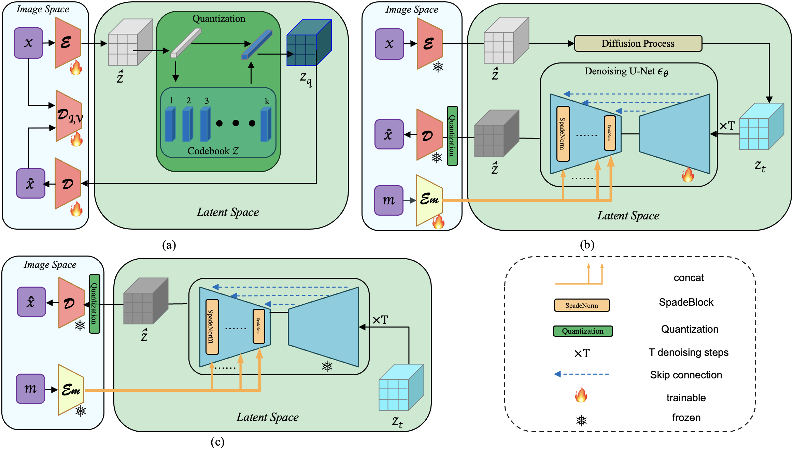
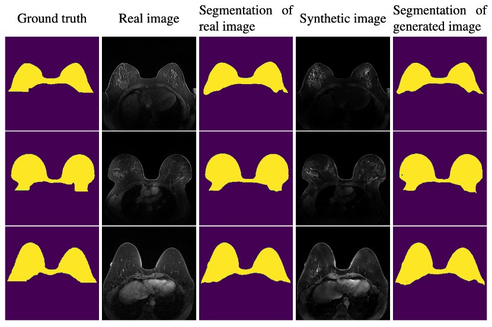

# Med-LSDM 3D Semantic Medical Images Synthesis via Latent Diffusion Model

In the medical domain, acquiring large datasets is challenging due to both accessibility issues and stringent privacy regulations. Consequently, data availability and privacy protection are major obstacles to applying machine learning in medical imaging. To address this, our study proposes the Med-LSDM (Latent Semantic Diffusion Model), which operates directly in the 3D domain and leverages de-identified semantic maps to generate synthetic data as a method of privacy preservation and data augmentation. Unlike many existing methods that focus on generating 2D slices, Med-LSDM is designed specifically for 3D semantic image synthesis, making it well-suited for applications requiring full volumetric data. Med-LSDM incorporates a guiding mechanism that controls the 3D image generation process by applying a diffusion model within the latent space of a pre-trained VQ-GAN. By operating in the compressed latent space, the model significantly reduces computational complexity while still preserving critical 3D spatial details. Our approach demonstrates strong performance in 3D semantic medical image synthesis, achieving a 3D-FID score of 0.0054 on the conditional Duke Breast dataset and similar Dice scores (0.70964) to those of real images (0.71496). These results prove the synthetic data from our model has small domain gap with real data and is useful for data augmentation.

## Med-LSDM Framework
we utilize Med-LSDM (Latent Semantic Diffusion Model) architecture for 3D Semantic Medical Image Synthesis. First, we present the whole
architecture, then we introduce 3D VQ-GAN and Semantic Diffusion model in detail. To the
best of our knowledge, it is the first work to generate 3D medical images from semantic maps
using latent diffusion.


## System Requirements
This code has been tested on Ubuntu 20.04 and an NVIDIA A6000 GPU. Furthermore it was developed using Python v3.8.

## Setup
First, clone this repository:
```
git https://github.com/TWWinde/medicaldiffusion.git
cd medicaldiffusion
```

In order to run our model, we suggest you create a virtual environment 
```
conda create -n semanticmedicaldiffusion python=3.8
``` 
and activate it with 
```
conda activate semanticmedicaldiffusion
```
Subsequently, download and install the required libraries by running 
```
pip install -r requirements.txt
```
## Datasets
We conduct our methods on three benchmark datasets: AutoPET, SynthRAD2023 and Duke Breast dataset.
## Training
First, we need to train the three-dimensional VQ-GAN model.  You can run the following command:

```
sbatch vqgan.sh
```
Note that you need to provide the path to the dataset (e.g. ```dataset.root_dir='/data/
'```) to successfully run the command.

To train the diffusion model in the latent space of the previously trained VQ-GAN model, you need to run the following command
```
sbatch diffusion.sh
```
You again need to specify the path to the VQ-GAN checkpoint from before (e.g. ```model.vqgan_ckpt='/checkpoints/latest_checkpoint.ckpt'```)

## Results

### Qualitative Results
The images are real images, labels and synthetic images(from left to right)

| <br/>|||
|---|----------------------------------------------------------------------------------|----------------------------------------------------------------------------------|

|  <br/> |  |  |
|------------------------------------------------------------------------------------------|-------------------------------------------------------------------------------------|-------------------------------------------------------------------------------------|

|  <br/> |  |  |
|------------------------------------------------------------------------------------------|-------------------------------------------------------------------------------------|-------------------------------------------------------------------------------------|

|  <br/> |  |  |
|-----------------------------------------------------------------------------------------|------------------------------------------------------------------------------------|------------------------------------------------------------------------------------|

### Progressive Denosing


### Quantitative Results

| Dataset  | Decoder | #channels | FID   | 3D-FID | LPIPS | SSIM   | RMSE  | PSNR  |
|----------|---------|-----------|-------|--------|-------|--------|-------|-------|
| AutoPET  | normal  | 37        | 200.45| 0.0090 | 0.19  | 0.6307 | 0.13  | 17.75 |
| AutoPET  | normal  | 64        | 196.78| 0.0090 | 0.19  | 0.8374 | 0.13  | 17.75 |
| AutoPET  | normal  | 128       | 197.06| 0.0094 | 0.24  | 0.7090 | 0.41  | 7.74  |
| AutoPET  | SPADE   | 64        | 197.02| 0.0089 | 0.18  | 0.9969 | 0.16  | 15.93 |
| SynthRAD | normal  | 32        | 200.45| 0.0060 | 0.25  | 0.6307 | 0.32  | 9.91  |
| SynthRAD | SPADE   | 32        | 198.03| 0.0061 | 0.27  | 0.6147 | 0.36  | 8.89  |
| Duke     | normal  | 8         | 193.09| 0.0059 | 0.28  | 0.9390 | 0.20  | 14.95 |
| Duke     | SPADE   | 8         | 193.62| 0.0054 | 0.29  | 0.9271 | 0.21  | 14.87 |

### Synthetic Data can Confuse Segmentation Network
We train a 3D U-Net on real data and test on both synthetic and real data.
Hypothesis: if the generated images belong to the same distribution as real image, the segmentation network should produce similar results on both types of images


| Data resource         | Dice    |
|-----------------------|---------|
| Real data (train set) | 0.75041 |
| Real data (test set)  | 0.71496 | 
| Synthetic Data        | 0.60197 |


## Conclusion

In this study, we propose a framework Med-LSDM (Latent Semantic Diffusion Model) for 3D semantic image synthesis for medical imaging. The architecture of the network consists of three key components:  a 3D VQ-GAN and a 3D Semantic Diffusion Model. We implement the diffusion model in the learned latent space of VQ-GAN. Our aim is to generate more medical data from semantic map for the down stream tasks, such as semantic image segmentation and recognition. Challenges caused by the complexity and sensitivity of the data involved. 

The effect of our framework was validated on three challenging datasets: AutoPET, SynthRAD2023 and Duke Breast dataset. The proposed framework achieves a  promising results. According to ablation study, we observed that the model performed significantly better on CT images compared to MR images in terms of performance metrics.

Our experiments prove that the model could effectively bridge the domain gap between real and generated data, as evidenced by the high similarity in segmentation results on both real and synthetic images. This finding highlights the potential of using synthetic data to augment real datasets in medical image analysis tasks.